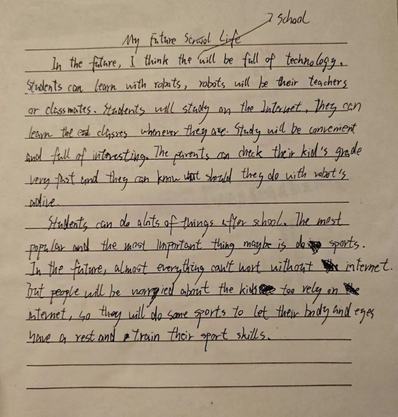
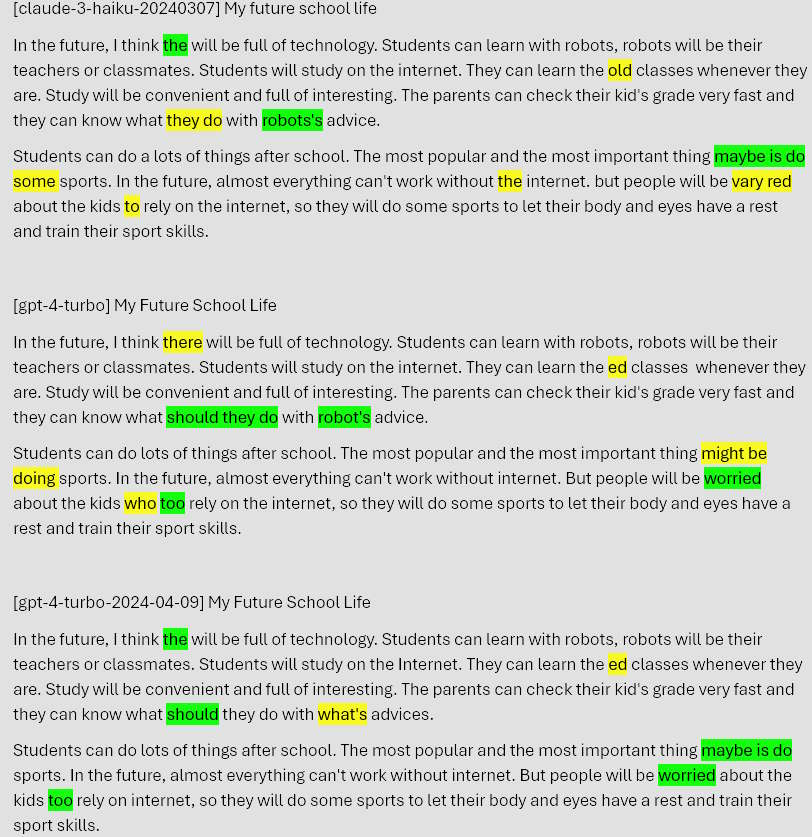

# 中小学生英语作文AI助手

娃写作文头疼，我也头疼。在GPT商店里创建了一个GPTs，欢迎使用：https://chat.openai.com/g/g-sVfveSG9j-xue-sheng-ying-yu-zuo-wen-pi-gai

打开GPTs还是有点不方便，所以想到了做一个网页助手，拍照丢照片进去，让它给批改。

难点在于手写识别，特别是非常潦草的中国小孩写英文。试验了十来个各家OCR，发现对这种手写支持并不好。然后试了以GPT4V为首的diffusion技术的OCR，效果不错。做了一些对比如下。

下面是娃写的作文

下面是尝试了几个不同的API，识别率总体不错，差别都集中的几个地方，标注如下，黄色为识别错误，绿色为识别正确

但是费用差别大啊，果断采用claude-3-haiku-20240307
